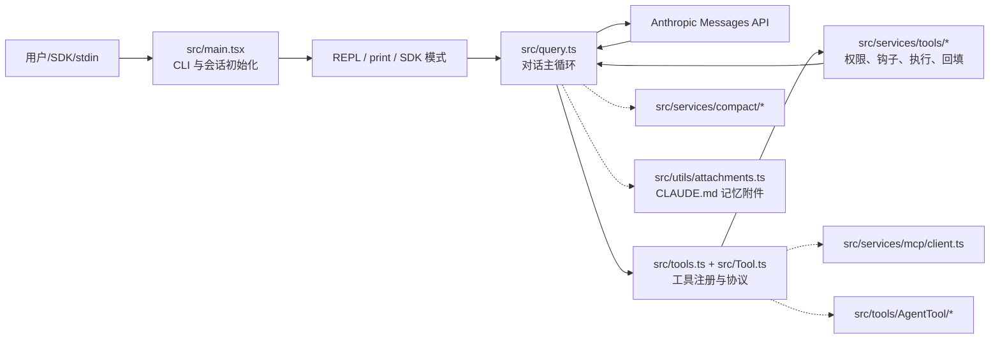
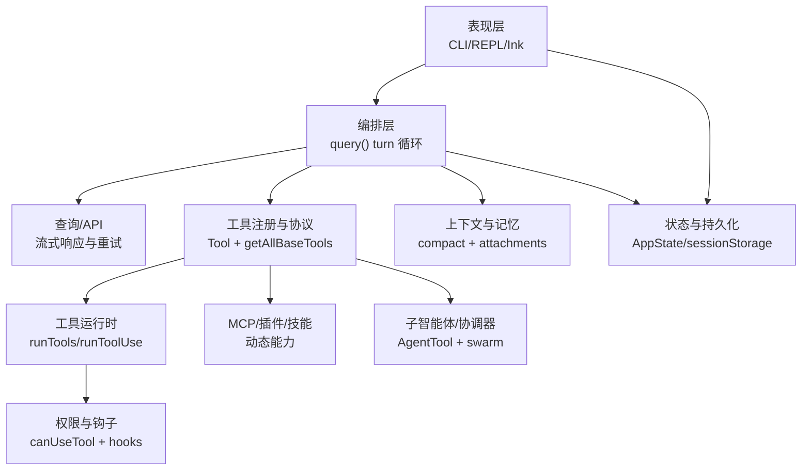
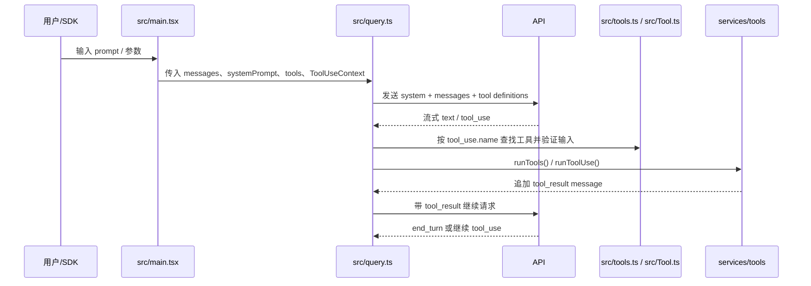

# Claude Code 源码运行逻辑理解指南

## 1. 适用与不适用场景

- 何时用：需要理解本仓库 Claude Code v2.1.88 的主运行链路、工具调用、权限管线、MCP 接入、上下文压缩、记忆注入、子智能体和插件/技能机制。
- 何时用：需要回答“模型返回 tool_use 后代码怎么执行工具并把 tool_result 回填？”、“某个工具为什么没出现在工具列表？”、“权限为什么 ask/deny？”这类源码定位问题。
- 何时不用：只想学习 Claude Code 的用户操作教程、官方产品行为、商业许可或最新版本变化。
- 何时不用：需要复原被 feature gate 移除的 Anthropic 内部模块；本仓库只能观察已发布源码和残留接口。

## 2. 系统上下文

这个仓库是从 `@anthropic-ai/claude-code` 2.1.88 npm 包提取的 TypeScript 源码研究仓库。运行主干是一个 Agent Harness：CLI/REPL 收用户输入，`query()` 维护消息循环，API 返回文本或 `tool_use`，工具系统执行后追加 `tool_result`，循环直到 turn 结束。

输入/输出：
- 输入：CLI 参数、REPL 用户输入、stdin/SDK 结构化输入、配置、CLAUDE.md、MCP 服务器声明、插件与技能。
- 输出：终端 UI、SDK/stream-json 事件、工具结果消息、会话 transcript、遥测和调试日志。

核心边界：
- Anthropic Messages API：`src/services/api/claude.ts` 与 `src/query.ts`。
- 文件/进程/网络/MCP：各 `src/tools/*`、`src/services/mcp/client.ts`、`src/utils/Shell.ts`。
- 终端 UI：`src/main.tsx`、`src/replLauncher.ts`、`src/components/*`、`src/ink/*`。

## 3. 架构风格与 capability 地图

风格：分层 Agent Harness + 数据驱动循环 + 插件式能力注册。证据：`src/main.tsx` 组装启动环境和 REPL；`src/query.ts:219` 导出异步生成器主循环；`src/tools.ts:193` 汇总内置工具；`src/services/tools/toolOrchestration.ts:19` 将连续工具调用分批执行。

核心 capability：
- 表现层：解析命令、选择交互/非交互模式、启动 REPL。主要看 `src/main.tsx`、`src/replLauncher.ts`、`src/components/*`、`src/ink/*`。信念态：observed。
- 编排层：维护 messages、turn、stop reason、预算、压缩和工具执行之间的循环。主要看 `src/query.ts`。信念态：observed。
- 查询/API：组装 system prompt、messages、tools，处理流式响应、重试、token 预算。主要看 `src/query.ts`、`src/services/api/claude.ts`、`src/query/*`。信念态：observed。
- 工具注册与协议：定义 `Tool`、`ToolUseContext`、输入 schema、权限、只读/并发属性，汇总内置和动态工具。主要看 `src/Tool.ts`、`src/tools.ts`。信念态：observed。
- 工具运行时：把模型的 `tool_use` block 分批执行，生成 progress 和 `tool_result`。主要看 `src/services/tools/toolOrchestration.ts`、`src/services/tools/toolExecution.ts`。信念态：observed。
- 权限与钩子：将工具自带权限、通用权限规则、用户确认、Pre/Post hooks 串起来。主要看 `src/utils/permissions/permissions.ts`、`src/utils/hooks.ts`、`src/services/tools/toolHooks.ts`。信念态：observed。
- 上下文与记忆：处理 token 阈值、auto compact、manual compact、CLAUDE.md 与相关记忆附件。主要看 `src/services/compact/*`、`src/utils/attachments.ts`、`src/memdir/*`。信念态：observed。
- MCP/插件/技能：把外部 MCP 工具、插件和技能适配成内部工具/命令/资源。主要看 `src/services/mcp/client.ts`、`src/utils/plugins/*`、`src/skills/*`、`src/tools/SkillTool/*`。信念态：observed。
- 子智能体与协调器：通过 `AgentTool` 派生独立上下文执行子任务，协调器/队友模式属于更高层编排。主要看 `src/tools/AgentTool/*`、`src/utils/swarm/*`、`src/coordinator/*`。信念态：observed。
- 状态与持久化：AppState、session transcript、工具结果外置化和恢复。主要看 `src/state/*`、`src/bootstrap/state.ts`、`src/utils/sessionStorage.ts`、`src/utils/toolResultStorage.ts`。信念态：observed。

## 4. 核心运行逻辑

优先从“消息数组驱动系统”理解：用户输入被追加为 message，API 基于 messages 产生 assistant message；若 assistant message 包含 `tool_use`，工具执行结果再以 `tool_result` 形式追加回 messages。循环的状态不是隐藏在某个大对象里，而是分散在 messages、`ToolUseContext`、AppState、权限上下文和压缩状态中。

主要入口：
- `src/main.tsx:1868` 初始化工具列表，`src/main.tsx:2704` 合并 MCP 工具/命令/资源，`src/main.tsx:3134` 等位置进入 `launchRepl()`。
- `src/query.ts:219` 是主循环入口；同文件 `src/query.ts:301` 启动相关记忆预取，`src/query.ts:528` 与 `src/query.ts:1148` 使用压缩结果重建 messages。
- `src/tools.ts:193` 定义内置工具全集；`src/tools.ts:337` 附近说明内置工具与 MCP 工具合并关系。
- `src/Tool.ts:158` 定义工具执行上下文；`src/Tool.ts:362` 定义工具协议；`src/Tool.ts:500` 定义工具级权限检查。
- `src/services/tools/toolOrchestration.ts:19` 执行一个或多个 `tool_use`；`src/services/tools/toolExecution.ts:337` 执行单个工具；`src/services/tools/toolExecution.ts:599` 串起权限检查和实际调用。

## 5. 关键端到端调用链

### 标准工具调用流程

证据：`src/query.ts:219`、`src/services/tools/toolOrchestration.ts:19`、`src/services/tools/toolExecution.ts:337`、`src/utils/queryHelpers.ts:286`。

### 权限判定路径

1. 模型产出 `tool_use` 后，工具输入先过 `inputSchema.safeParse`；失败会转成错误结果。
2. `runToolUse()` 进入 `streamedCheckPermissionsAndCallTool()`，再到 `checkPermissionsAndCallTool()`。
3. 通用权限逻辑调用工具自己的 `checkPermissions()`，再结合 mode、always allow/deny/ask、hook、classifier 或用户确认。
4. PreToolUse hook 可影响权限结果；PostToolUse/PostToolUseFailure hook 处理执行后事件。
5. 允许后才调用工具主体；拒绝时生成拒绝消息或错误结果。

证据：`src/services/tools/toolExecution.ts:492`、`src/services/tools/toolExecution.ts:599`、`src/utils/permissions/permissions.ts:1120`、`src/utils/hooks.ts:1952`、`src/services/tools/toolHooks.ts`。

### 上下文压缩路径

1. `query()` 每轮跟踪 token 使用和 compact 状态。
2. `isAutoCompactEnabled()` 检查环境变量与用户配置。
3. `shouldAutoCompact()` 根据模型上下文窗口、保留 buffer、递归保护和 feature gate 决定是否压缩。
4. 压缩完成后，`buildPostCompactMessages()` 构造新的 messages，主循环继续运行。

证据：`src/query.ts:10`、`src/query.ts:528`、`src/services/compact/autoCompact.ts:147`、`src/services/compact/compact.ts:330`。

### MCP 工具动态注册路径

1. 启动阶段读取 MCP 配置并建立 client。
2. `getMcpToolsCommandsAndResources()` 拉取 MCP tools、commands、resources。
3. MCP tool 被适配为内部 `Tool`，包括输入 schema、权限行为和调用代理。
4. `tools.ts` 将内置工具与 MCP 工具合并，供 `query()` 暴露给模型。

证据：`src/main.tsx:2704`、`src/services/mcp/client.ts:1814`、`src/services/mcp/client.ts:2226`、`src/tools.ts:337`。

### 子智能体 Fork 路径

1. 模型选择 `AgentTool`，输入描述子任务和可用工具范围。
2. `AgentTool` 权限检查后进入 agent runner。
3. 子智能体创建独立 `ToolUseContext`、messages 和工具过滤结果，递归调用查询循环。
4. 子智能体最终输出被汇总成父会话的工具结果。

证据：`src/tools/AgentTool/AgentTool.tsx:196`、`src/tools/AgentTool/AgentTool.tsx:1281`、`src/tools/AgentTool/runAgent.ts`、`src/tools/AgentTool/agentToolUtils.ts`。

## 6. 横切关注点

- 错误处理：工具错误通过 `classifyToolError()`、`formatError()`、`processToolResultBlock()` 等路径转成安全可展示结果；看 `src/services/tools/toolExecution.ts`。
- 日志与遥测：`logEvent`、OTel、session tracing 分散在 API、工具执行、权限和 telemetry 目录；看 `src/services/analytics/*`、`src/utils/telemetry/*`。
- 配置加载：CLI flags、settings、policy/managed settings、env 共同影响启动；看 `src/main.tsx`、`src/utils/settings/*`、`src/services/remoteManagedSettings/*`。
- 并发模型：`runTools()` 将连续并发安全工具批量并行，其余串行；看 `src/services/tools/toolOrchestration.ts:19`。
- 生命周期：启动初始化在 `src/main.tsx`，会话 hooks 在 `src/utils/sessionStart.ts` 和 `src/utils/hooks.ts`，清理注册在 `src/utils/cleanupRegistry.js`。
- 扩展点：工具协议、MCP、hooks、plugins、skills、commands 都是扩展面；先看 `src/Tool.ts`、`src/services/mcp/client.ts`、`src/utils/plugins/*`、`src/tools/SkillTool/*`。

## 7. 关键不变量与边界

- `tool_use` 必须有匹配的 `tool_result`，否则 API 侧会拒绝或恢复逻辑需要补洞；证据：`src/utils/messages.ts` 和 `src/utils/queryHelpers.ts:286` 多处处理 pairing。
- 工具输入必须先过 schema；不要绕过 `Tool` 协议直接调用实现，否则权限、hook、遥测和结果外置化都会缺失；证据：`src/Tool.ts:362`、`src/services/tools/toolExecution.ts:599`。
- 并发只对 `isConcurrencySafe()` 返回 true 的工具批次开放；写操作或解析失败默认保守串行；证据：`src/services/tools/toolOrchestration.ts`。
- auto compact 不是简单按百分比触发，还要避开 compact/session_memory 等递归来源；证据：`src/services/compact/autoCompact.ts`。
- MCP 工具和内置工具最终都必须适配成内部 `Tool`，所以排查 MCP 时也要按工具协议排查；证据：`src/services/mcp/client.ts:1814`、`src/tools.ts:337`。

概念边界：
- `Tool` vs `Command`：Tool 暴露给模型作为可调用能力；Command 面向 slash command/CLI 操作。
- `tool_use` vs `tool_result`：前者来自 assistant/API，后者来自工具执行并作为 user message 回填。
- CLAUDE.md 记忆 vs session transcript：前者是项目/用户指令注入，后者是会话历史持久化。
- Plugin vs Skill vs MCP：Plugin 是本地扩展包，Skill 是模型可加载的领域说明/能力，MCP 是外部协议服务器。
- AgentTool vs coordinator/swarm：AgentTool 是派生子智能体的工具入口，coordinator/swarm 是更高层多智能体协作形态。

## 8. 排查与修改入口

| 问题表象 | 应该先看 | 该层负责什么 |
| --- | --- | --- |
| 工具没有出现在模型可用列表 | `src/tools.ts`、`src/main.tsx`、`src/services/mcp/client.ts` | 内置工具启用、权限模式过滤、MCP 合并 |
| 工具输入校验失败 | `src/Tool.ts`、对应 `src/tools/<ToolName>/*` | Zod schema、normalize input、错误展示 |
| 工具执行后没有回填结果 | `src/services/tools/toolExecution.ts`、`src/utils/queryHelpers.ts`、`src/utils/toolResultStorage.ts` | 执行、结果持久化、tool_result pairing |
| 权限被拒绝或一直 ask | `src/utils/permissions/permissions.ts`、`src/services/tools/toolHooks.ts`、`src/hooks/toolPermission/*` | mode、allow/deny/ask 规则、hook、classifier |
| Pre/Post hook 没生效 | `src/utils/hooks.ts`、`src/utils/settings/settings.ts`、`src/utils/plugins/loadPluginHooks.ts` | hook 配置解析、事件派发、插件 hook |
| 上下文爆满或压缩异常 | `src/query.ts`、`src/services/compact/autoCompact.ts`、`src/services/compact/compact.ts` | token 阈值、compact 执行、post-compact messages |
| CLAUDE.md 没注入 | `src/utils/attachments.ts`、`src/memdir/*`、`src/main.tsx` | 记忆发现、相关性预取、additional directories |
| MCP 工具未注册 | `src/services/mcp/client.ts`、`src/services/mcp/config.ts`、`src/tools.ts` | MCP 配置、连接、工具适配与合并 |
| 子智能体行为异常 | `src/tools/AgentTool/AgentTool.tsx`、`src/tools/AgentTool/runAgent.ts`、`src/tools/AgentTool/agentToolUtils.ts` | 子任务输入、上下文继承、工具过滤、结果汇总 |
| 插件或 skill 没加载 | `src/utils/plugins/*`、`src/plugins/bundled/index.ts`、`src/skills/bundled/index.ts`、`src/tools/SkillTool/*` | 插件缓存、内置 skill、SkillTool 触发 |

## 9. 信念账本

observed：
- `src/query.ts:219` 直接导出 `query()` 异步生成器，是主对话循环入口。
- `src/tools.ts:193` 直接定义 `getAllBaseTools()`，是内置工具集合的核心来源。
- `src/Tool.ts:158` 和 `src/Tool.ts:362` 直接定义工具上下文和工具协议。
- `src/services/tools/toolOrchestration.ts:19` 直接定义 `runTools()`，负责并发安全批次和串行批次。
- `src/services/tools/toolExecution.ts:337` 与 `src/services/tools/toolExecution.ts:599` 直接定义单工具执行与权限后调用路径。
- `src/services/compact/autoCompact.ts:147` 直接定义 auto compact 启用条件。
- `src/services/mcp/client.ts:2226` 直接定义 MCP 工具/命令/资源获取入口。

inferred：
- 整体架构是分层 Agent Harness；支撑来自 `src/main.tsx`、`src/query.ts`、`src/tools.ts` 和源码导航地图的层级关系，置信度高。
- 消息数组是最重要的数据驱动载体；支撑来自 `query()`、`createUserMessage()`、`tool_use/tool_result` pairing 处理，置信度高。
- MCP、Skill、Plugin 都最终围绕工具/命令/资源扩展主循环；支撑来自 `src/services/mcp/client.ts`、`src/utils/plugins/*`、`src/tools/SkillTool/*`，置信度中。

unknown / unexplored：
- README 标注有大量 feature-gated 内部模块未包含，不能从本仓库确认其真实实现。
- `feature('KAIROS')`、`feature('CONTEXT_COLLAPSE')`、`feature('WORKFLOW_SCRIPTS')` 等门控路径只能看到外部构建中的残留调用点。
- 远端服务、GrowthBook 配置、Anthropic 内部 policy 的真实线上行为不能仅凭本仓库断言。

## 10. 术语表

| 术语 | 含义 | 易混淆点 |
| --- | --- | --- |
| Agent Harness | 模型外的运行外壳：循环、工具、权限、上下文、状态 | 不是模型本身 |
| turn | 一轮用户输入到模型完成响应的迭代 | 一个 turn 内可多次 API/工具循环 |
| messages | 发给 API 的会话消息数组 | UI 状态和 transcript 会有各自映射 |
| tool_use | 模型请求调用工具的 assistant content block | 不是工具执行结果 |
| tool_result | 工具执行后回填给模型的 user content block | 必须能对应 tool_use id |
| ToolUseContext | 工具执行时携带的会话上下文和回调集合 | 不等同于 React/AppState |
| permission mode | default/plan/bypass 等权限模式 | 还会叠加 allow/deny/ask 规则 |
| hook | 工具或会话生命周期扩展点 | 与 React hook 无关 |
| compact | 对话历史压缩机制 | 不是简单删除消息 |
| MCP | Model Context Protocol 外部工具/资源协议 | MCP 工具仍需适配内部 Tool |
| Skill | 领域说明和工作流能力包 | 与 Plugin、MCP 不是同一层 |
| AgentTool | 派生子智能体执行子任务的工具 | 不等于所有多智能体机制 |
